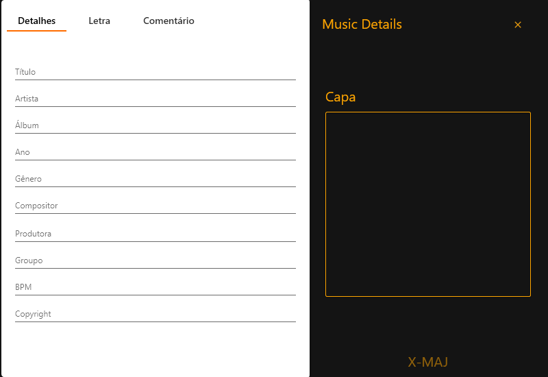
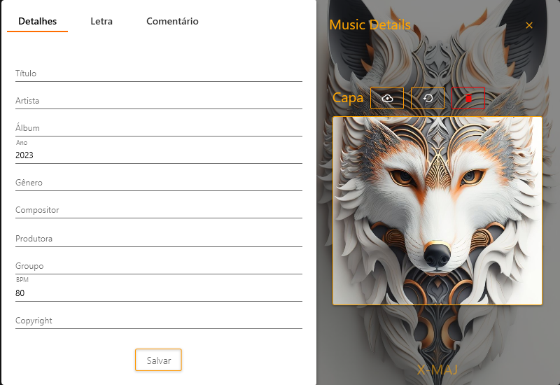
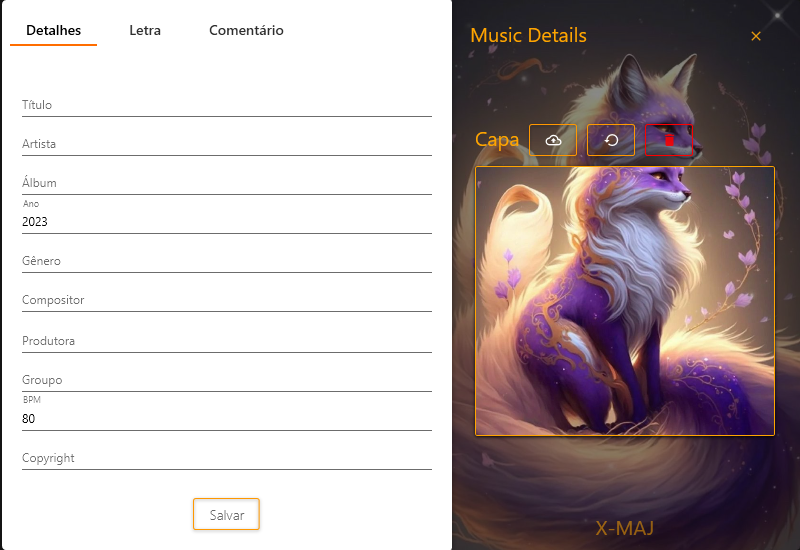
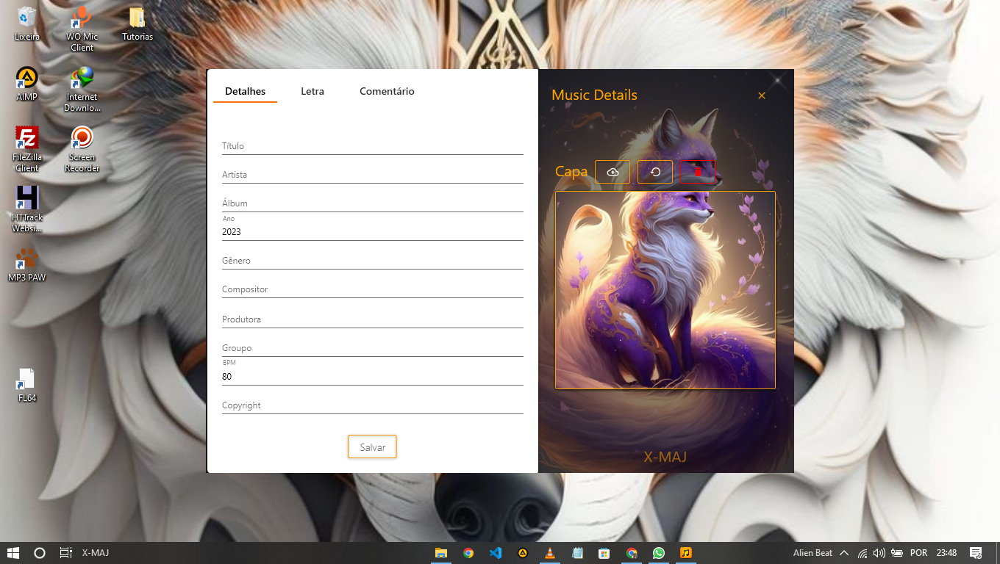

# Music Details - Editor de Etiquetas de Música

O Music Details é um programa desenvolvido no Visual Studio que permite a edição de etiquetas de música, proporcionando uma maneira fácil e eficiente de organizar e gerenciar informações importantes relacionadas a f musicais. Com este programa , você pode personalizar e aprimorar as informações das suas músicas favoritas, como título, artistas, álbum, ano de lançamento, gênero, compositor, grupo, BPM, copyright, letra, comentário e até mesmo adicionar, remover ou atualizar a cover da música.

## Demonstração

Assista ao vídeo de demonstração para ver o Music Details em ação:

## Instalação

1. Faça o clone deste repositório.
2. Execute o programa resultante.
3. Arrasta um arquivo de Áudio
4. Agora é só editar
6. 
## Contribuição

Contribuições são bem-vindas! Se você encontrou algum problema, tem alguma ideia de melhoria.
